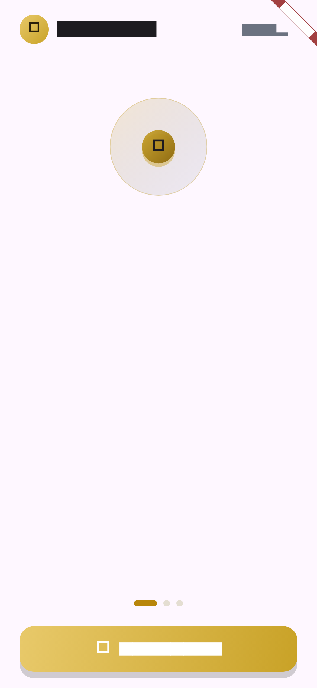
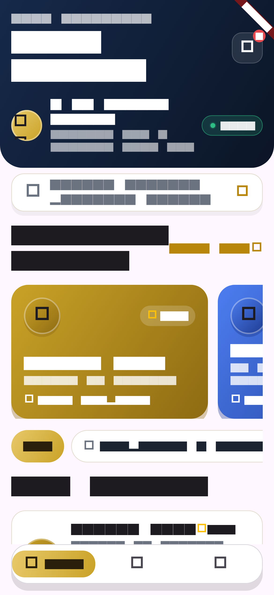
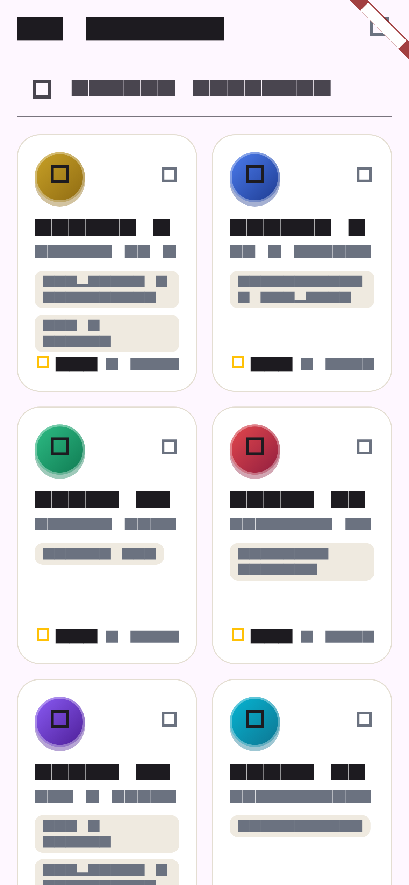
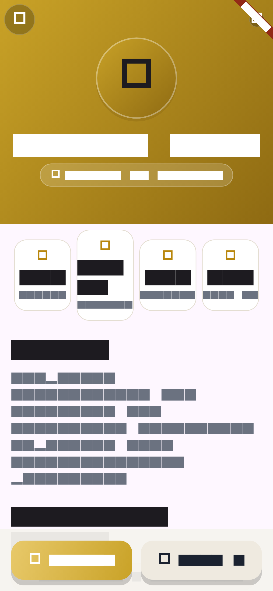
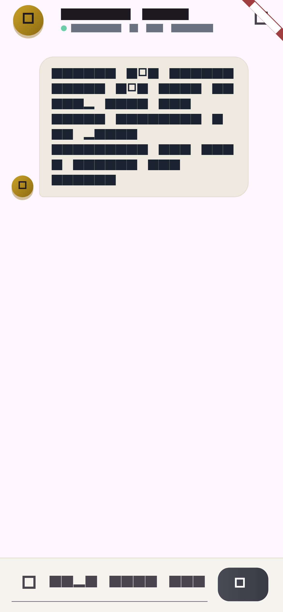
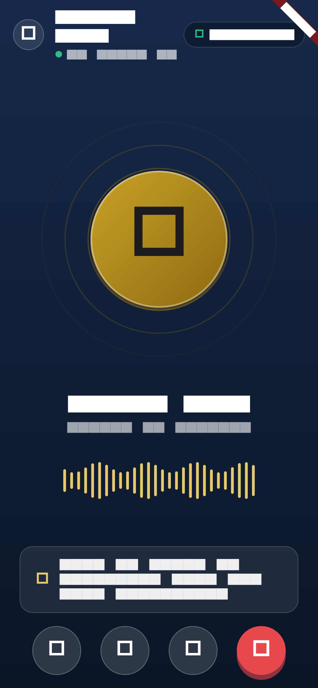
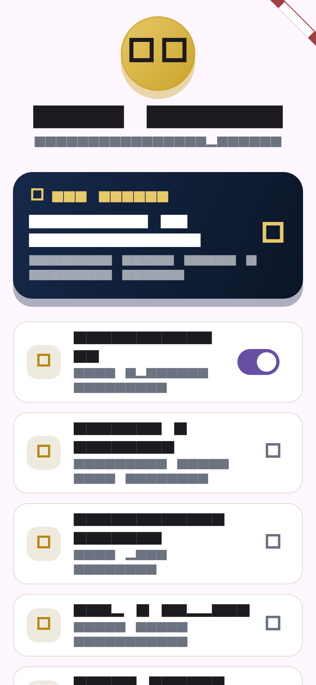
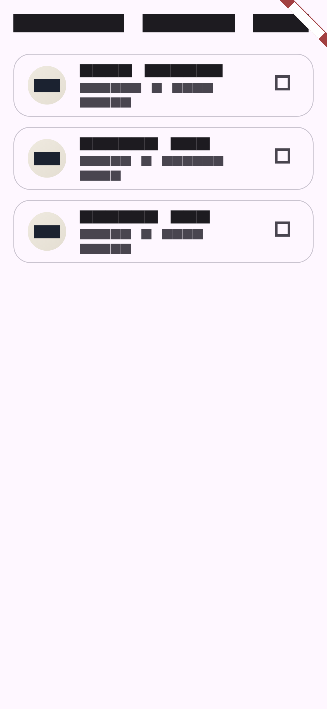

<div align="center">

# ⚖️ LexiAI

### Legal counsel, powered by AI

**Consult with animated AI lawyer agents over video calls or text chat — 24/7, in plain language, across 8+ practice areas.**

A production-grade Flutter reference architecture built with **GetX**, **Retrofit**, **Clean-ish Architecture layers**, and a state-of-the-art animated UI.

[](https://flutter.dev)
[](https://dart.dev)
[](LICENSE)
[](CONTRIBUTING.md)

</div>

---

## 📖 Table of Contents

- [Overview](#-overview)
- [Features](#-features)
- [Screens](#-screens)
- [Tech Stack](#-tech-stack)
- [Architecture & Folder Structure](#-architecture--folder-structure)
- [Getting Started](#-getting-started)
- [Code Generation](#-code-generation)
- [Testing](#-testing)
- [Roadmap](#-roadmap)
- [Contributing](#-contributing)
- [License](#-license)

---

## 🧭 Overview

LexiAI reimagines legal consulting. Instead of waiting days for an appointment with a human lawyer, users open the app and are instantly connected to **specialized AI agents** — animated avatars with distinct personalities, practice areas, ratings and track records — for a **live video consultation** or a **text chat**.

The agents explain the law in plain language, walk users through options, and de-escalate legal anxiety with warm, human-like interaction.

> **Note:** The agent catalogue is currently backed by a mock repository with simulated latency. A real backend can be dropped in by implementing one interface — see [Architecture](#-architecture--folder-structure).

---

## ✨ Features

### Product
- 🤖 **8 curated AI legal agents** across 8 practice areas (Corporate, Criminal, Family, IP, Tax, Immigration, Employment, Real Estate)
- 📹 **Simulated AI video consultation** — connecting state, pulsing avatar rings, live voice waveform, auto-captions, call controls
- 💬 **Text consultation** — chat bubbles, typing indicator, quick-question chips, simulated agent replies
- 🏠 **Rich home dashboard** — featured agents, practice-area filters, live online status, search
- 🔍 **Agent browsing & profiles** — searchable grid, stats, bios, languages
- 👤 **Profile & membership** — pro membership card, settings
- 🌗 **System-adaptive theming** — a gold & navy brand palette in both light and dark mode

### Engineering
- 🗂️ **Production folder structure** — layered core + feature-first modules (see [structure](#-architecture--folder-structure))
- 🔌 **Repository pattern** — UI depends on abstractions; swap mock → remote in one line
- 🌐 **Retrofit + Dio** REST client with typed error mapping (timeout / offline / 401 / 500 → friendly messages)
- 🎨 **Centralized design system** — color palettes, dimensions, typography tokens, shared widgets
- 🧪 **Unit + widget tests** — controllers, repositories, onboarding flow, Lottie asset validation
- 🧩 **Fully animated UI** — `flutter_animate` micro-interactions, hand-crafted Lottie loader, shimmer skeletons, Hero-style transitions

---

## 📱 Screens

| Screen | Highlights |
| --- | --- |
| **Splash** | Staggered logo entrance, glow orbs, custom Lottie loader |
| **Onboarding** | 3 animated slides, gradient pagination dots, skip/continue flow |
| **Home** | Navy hero header, live-status pill, search, featured horizontal cards, filter chips, shimmer skeletons |
| **Agents** | Searchable responsive grid with per-agent tags and stats |
| **Agent Detail** | Gradient hero, stats row, bio, practice areas, sticky CTA bar |
| **AI Video Call** | Connecting → connected, pulsing rings, animated waveform, live captions, press-animated controls |
| **AI Chat** | Bubbles with entrance animations, bouncing-dots typing indicator, quick chips |
| **Profile** | Membership card, settings, sign-out |
| **Users (Demo)** | Live remote fetch via Retrofit (`dummyjson.com`) — reference for the remote pattern |

### Preview

| | | |
| --- | --- | --- |
|  |  |  |
|  |  |  |
|  |  |  |

*Screenshots are rendered automatically from golden tests — see [Preview generation](#preview-generation).*

---

## 🛠 Tech Stack

| Layer | Choice |
| --- | --- |
| Framework | Flutter 3.38+ (Material 3) |
| Language | Dart 3.10+ |
| State management | [GetX](https://pub.dev/packages/get) (reactive Rx, DI, routing) |
| Networking | [Retrofit](https://pub.dev/packages/retrofit) + [Dio](https://pub.dev/packages/dio) |
| Serialization | [json_serializable](https://pub.dev/packages/json_serializable) |
| Logging | [Talker](https://pub.dev/packages/talker) + TalkerDioLogger |
| Animations | [flutter_animate](https://pub.dev/packages/flutter_animate), [lottie](https://pub.dev/packages/lottie), [shimmer](https://pub.dev/packages/shimmer) |
| Fonts | [google_fonts](https://pub.dev/packages/google_fonts) — Playfair Display + Manrope |
| Equality | [equatable](https://pub.dev/packages/equatable) |

---

## 🏗 Architecture & Folder Structure

The project follows a **layered core + feature-first modules** layout — a pragmatic production structure for GetX apps: everything cross-cutting lives in `core/`, business logic and data contracts in `domain/` + `data/`, and each feature owns its screens, widgets and controller.

```
lib/
├── main.dart                      # Entry point: bootstrap DI, then runApp
├── app.dart                       # GetMaterialApp: themes, routes, transitions
├── bootstrap.dart                 # Central dependency injection (swap mock → remote here)
│
├── core/                          # Cross-cutting concerns (no feature code)
│   ├── app_imports.dart           # Barrel export for common imports
│   ├── config/app_config.dart     # baseUrl, app name, durations
│   ├── constants/                 # app_colors, app_dimensions, app_strings
│   ├── error/app_exception.dart   # Typed exceptions + friendly messages
│   ├── logger/app_logger.dart     # Global Talker logger
│   ├── network/                   # ApiClient (Dio), ApiInterceptor, Retrofit ApiService,
│   │                              # http_status_codes
│   ├── theme/app_theme.dart       # Light + dark ThemeData, brand gradients
│   ├── utils/formatters.dart      # compact numbers, short durations
│   └── widgets/                   # Reusable UI: LexiLogo, GradientButton, GlassCard,
│                                  # AgentAvatar, SectionHeader, Skeleton
│
├── base/
│   ├── base_controller.dart       # isLoading/error state, run(), error mapping, snacks
│   └── base_view.dart             # Declarative loading / error / content states
│
├── domain/                        # Business layer — pure Dart, no Flutter deps
│   ├── models/                    # LegalAgent entity, PracticeArea enum
│   └── repositories/              # Abstract contracts (AgentRepository, UserRepository)
│
├── data/                          # Implementation layer
│   ├── models/                    # Wire models (User + JSON serialization)
│   └── repositories/              # AgentRepositoryImpl (mock), UserRepositoryImpl (Retrofit)
│
├── features/                      # Feature-first modules
│   ├── splash/                    # Animated splash + custom Lottie loader
│   ├── onboarding/                # 3-slide onboarding
│   ├── main_shell/                # Bottom-nav shell + MainShellController
│   ├── home/                      # Dashboard (controller, screen, widgets)
│   ├── agents/                    # Agent browser grid
│   ├── agent_detail/              # Agent profile
│   ├── consultation/              # AI Chat + AI Video Call
│   ├── profile/                   # Account screen
│   └── users/                     # Retrofit remote-flow demo (dummyjson.com)
│
├── routes/
│   ├── app_routes.dart            # Named route constants
│   └── app_pages.dart             # GetPage table + bindings
│
└── shared/widgets/                # Widgets shared across features
```

### Data flow

```
UI (feature) → Controller (GetX, extends BaseController) → Repository (interface)
                                                              ├── AgentRepositoryImpl  (mock, ~900ms latency)
                                                              └── UserRepositoryImpl   (Retrofit → Dio → REST API)
```

### Swapping mock → real backend

```dart
// bootstrap.dart — the ONLY place that changes
..lazyPut<AgentRepository>(
  () => AgentRepositoryImplRemote(),   // your Retrofit-backed implementation
  fenix: true,
)
```

No screen, controller or widget needs to change — that's the payoff of the repository pattern.

---

## 🚀 Getting Started

### Prerequisites

- Flutter SDK **3.38+** (Dart 3.10+)
- Android Studio / Xcode toolchain (or a device/emulator)
- An internet connection (fonts are fetched at runtime on first launch)

### Setup

```bash
# 1. Clone the repository
git clone https://github.com/your-username/lexiai.git
cd lexiai

# 2. Install dependencies
flutter pub get

# 3. Run code generation (Retrofit + json_serializable)
dart run build_runner build --delete-conflicting-outputs

# 4. Run the app
flutter run
```

### Builds

```bash
flutter build apk --release        # Android
flutter build ios --release        # iOS (on macOS)
flutter build appbundle --release  # Play Store bundle
```

---

## ⚙️ Code Generation

This project uses `retrofit` and `json_serializable`. After editing annotated classes:

```bash
dart run build_runner build --delete-conflicting-outputs
```

> Tip: use `dart run build_runner watch` during development.

---

## 🧪 Testing

```bash
flutter test
```

The suite covers:

- Brand widget smoke tests (`LexiLogo`)
- Onboarding navigation flow (3 slides)
- Lottie asset decode validation (catches broken animation JSON)
- `AgentRepositoryImpl` contract behaviour
- `HomeController` + GetX dependency injection end-to-end

Run the linter and formatter before pushing:

```bash
flutter analyze
dart format --set-exit-if-changed lib test
```

### Preview generation

The screenshots in [Preview](#preview) are real renders, produced by golden tests that render every screen at phone size with the bundled brand fonts (Manrope + Playfair Display):

```bash
flutter test test/previews --update-goldens
```

New PNGs land in `test/previews/goldens/` — copy them to `docs/screenshots/` (the README references those paths). Note: golden tests compare pixels, so the committed goldens are regenerated after significant UI changes and may differ across platforms (regenerate locally if they drift).

---

## 🗺 Roadmap

- [ ] Real AI backend (WebRTC video + LLM chat) behind the existing repository contracts
- [ ] Authentication (JWT + secure token storage, 401 auto-refresh in `ApiInterceptor`)
- [ ] Consultation history + saved agents
- [ ] Localization (en/fr/es)
- [ ] CI pipeline (analyze → test → build) with GitHub Actions
- [ ] App icons & splash screen branding (`flutter_launcher_icons`)

---

## 🤝 Contributing

Contributions are what make the open-source community amazing. Any contributions you make are **greatly appreciated** — PRs, issues, feature ideas, and documentation are all welcome.

1. Fork the project
2. Create your feature branch: `git checkout -b feat/amazing-feature`
3. Commit your changes: `git commit -m 'feat: add amazing feature'`
4. Push: `git push origin feat/amazing-feature`
5. Open a pull request

Please make sure `flutter analyze` and `flutter test` pass before submitting.

---

## 📄 License

Distributed under the **MIT License**. See [LICENSE](LICENSE) for more information.

---

<div align="center">
Made with ⚖️ for accessible justice. Built with Flutter.
</div>
